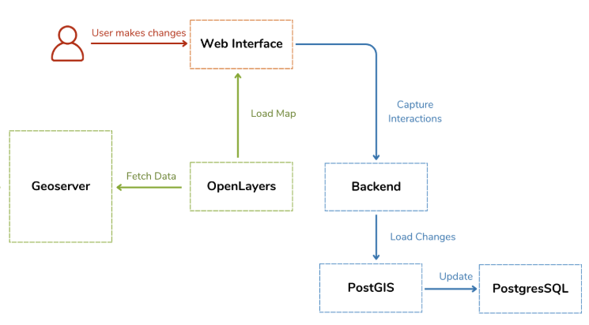

# 🗺️ NearSpot


**Discover hotels and restaurants near you with intelligent geospatial search.**

NearSpot is a powerful web application that helps you find establishments within a customizable radius from your location using real-time GPS or address search.

---

## ✨ Features

- 🌍 **Smart Location Search**: GPS geolocation or manual address input
- 🔍 **Radius-Based Filtering**: Search from 1km to 50km around your position
- 🏨 **Dual Categories**: Hotels (red markers) and Restaurants (green markers)
- 📏 **Distance Display**: See exact distance to each establishment
- ➕ **Contribute**: Add new hotels and restaurants directly on the map
- 🗺️ **Interactive Visualization**: Built with OpenLayers for smooth navigation
- ⚡ **Real-time Updates**: All changes instantly saved to PostgreSQL/PostGIS

---

## 🚀 Quick Start

---

## ✅ Prérequis

- PostgreSQL 12+
- Extension PostGIS
- Node.js 16+
- GeoServer 2.20+
- Navigateur web moderne

---

## 1. Configuration de la base de données

### Connexion à PostgreSQL

```bash
psql -U postgres
```

### Création de la base et activation de PostGIS

```sql
CREATE DATABASE OpenLayersProject;
\c OpenLayersProject
CREATE EXTENSION postgis;
```

---

## 2. Création des tables

```sql
CREATE TABLE hotels (
    id SERIAL PRIMARY KEY,
    name VARCHAR(255),
    longitude DOUBLE PRECISION,
    latitude DOUBLE PRECISION,
    geom GEOMETRY(Point, 4326)
);

CREATE TABLE restaurants (
    id SERIAL PRIMARY KEY,
    name VARCHAR(255),
    longitude DOUBLE PRECISION,
    latitude DOUBLE PRECISION,
    geom GEOMETRY(Point, 4326)
);
```

---

## 3. Import des données CSV

### Import des hôtels

```sql
\copy hotels(name, longitude, latitude)
FROM 'C:/path/to/hotels.csv'
DELIMITER ',' CSV HEADER;
```

### Import des restaurants

```sql
\copy restaurants(name, longitude, latitude)
FROM 'C:/path/to/restaurants.csv'
DELIMITER ',' CSV HEADER;
```

---

## 4. Création des géométries

```sql
UPDATE hotels
SET geom = ST_SetSRID(ST_MakePoint(longitude, latitude), 4326);

UPDATE restaurants
SET geom = ST_SetSRID(ST_MakePoint(longitude, latitude), 4326);
```

---

## 5. Publication des couches dans GeoServer

1. Créer un espace de travail : `projet_gis`
2. Ajouter un entrepôt PostGIS :
   - Base : `OpenLayersProject`
   - Nom : `postgis_store`
3. Publier les couches :
   - `hotels`
   - `restaurants`
4. Définir le CRS : `EPSG:4326`
5. Calculer les emprises et sauvegarder

Les couches sont visibles dans **Prévisualisation de la couche**.

---

**6. Configure Backend**

Edit `server/service.js`:

```javascript
const pool = new Pool({
  user: "postgres",
  database: "nearspot",
  password: "your_password",
  port: 5432,
});
```

**7. Start Server**

```bash
cd server
npm install
node service.js
```

**8. Launch Application**

Open `client/index.html` in your browser or serve it:

```bash
cd client
python -m http.server 8000
```

Visit `http://localhost:8000`

---

## 💡 Usage

1. **Search by Location**

   - Enter an address (e.g., "Paris, France") or use GPS
   - Select search radius (1km - 50km)
   - Choose type: Hotels, Restaurants, or Both

2. **View Results**

   - 🔵 Blue marker = Your position
   - 🔴 Red markers = Hotels
   - 🟢 Green markers = Restaurants

3. **Add Establishments**

   - Select type (Hotel/Restaurant)
   - Enter name
   - Click "Activate Add Mode"
   - Click on map to place marker

4. **Get Details**
   - Click any marker to see name, coordinates, and distance

---

## 🏗️ Architecture



---

## 🔌 API Endpoints

| Method | Endpoint           | Description                            |
| ------ | ------------------ | -------------------------------------- |
| GET    | `/api/nearby`      | Search establishments near coordinates |
| GET    | `/api/hotels`      | Get all hotels                         |
| GET    | `/api/restaurants` | Get all restaurants                    |
| POST   | `/api/hotels`      | Add new hotel                          |
| POST   | `/api/restaurants` | Add new restaurant                     |
| DELETE | `/api/:type/:name` | Delete establishment                   |
| GET    | `/api/stats`       | Database statistics                    |

**Example Request:**

```
GET /api/nearby?longitude=2.3522&latitude=48.8566&radius=5000&type=both
```

---

## 📁 Project Structure

```
NearSpot/
├── server/
│   ├── service.js       # Express API server
│   └── package.json     # Dependencies
├── client/
│   ├── index.html       # Main interface
│   ├── style.css        # Styles
│   └── app.js           # OpenLayers logic
└── README.md
```

---

## 🛠️ Technologies

**Frontend**: OpenLayers, HTML5, CSS3, JavaScript ES6+  
**Backend**: Node.js, Express.js  
**Database**: PostgreSQL, PostGIS (ST_DWithin, ST_Distance)  
**GIS Server**: GeoServer (optional)  
**Geocoding**: Nominatim API

---
